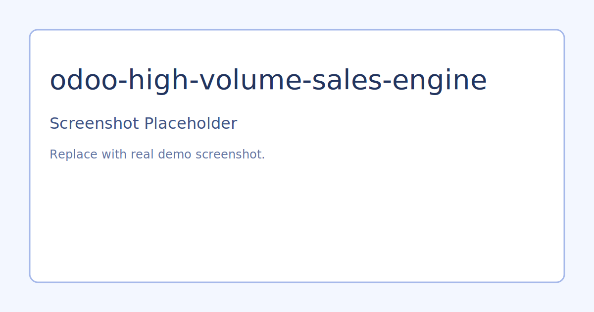

# Odoo High Volume Sales Order Engine

## Problem
Large agricultural operations can ingest thousands of orders per hour from field tools, payment systems, or partner channels. Default one-by-one creation patterns create lock contention and duplicate records during retries.

## Solution
This project implements a bulk ingestion service for Odoo Sales focused on throughput and reliability.

## What It Demonstrates
- Idempotent ingestion using deterministic external order references
- Chunked create operations for safer transaction boundaries
- Simple benchmark script for synthetic load generation
- Test scaffold for import behavior

## Architecture
- `addons/sale_bulk_engine/models/sale_bulk_service.py`
- `scripts/benchmark_orders.py`
- `docs/performance_baseline.md`

## Demo Flow
1. Install addon in an Odoo 16+ instance.
2. Generate payloads with `python scripts/benchmark_orders.py 10000 > payload.json`.
3. Call `sale.bulk.service.import_orders` from Odoo shell.
4. Record latency and throughput in `docs/performance_baseline.md`.

## Portfolio Talking Points
- How you prevent duplicates in eventually consistent integrations.
- Why chunked commits can improve recoverability during peak load.
- How to capture before/after metrics for business-facing reporting.

## Screenshots

Replace ssets/screenshots/placeholder.svg with real screenshots from your Odoo demo environment.

